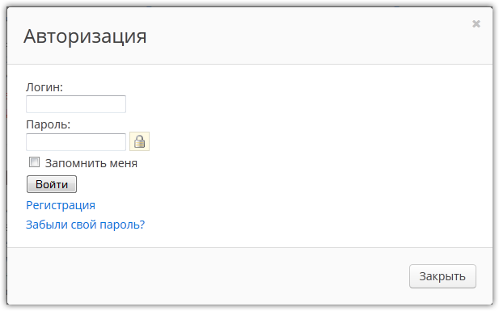
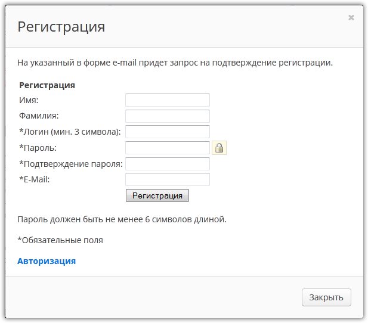
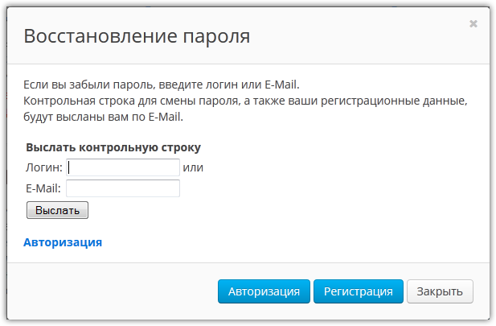
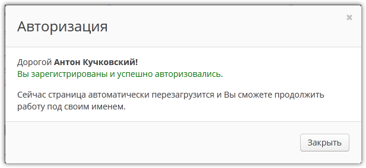

#Аякс форма авторизации и регистрации Битрикс на jQuery Ajax

Сегодня научимся делать **формы авторизации, регистрации и восстановления пароля на стандартных шаблонах Битрикс с помощью jQuery Ajax**, которые без перезагрузки страницы будут проверять валидность логина и пароля, выводить ошибки, авторизовывать, регистрировать и отправлять информацию о восстановлении пароля.  
Если вы еще не изучили метод **jQuery.ajax()**, обязательно изучите, без него ни один проект не полноценен.

Модальные окна у меня работают на **css-фреймворке** **Uikit**, как и весь сайт, поэтому у Вас вызов модальных окон не будет работать, придется самим модальные окна сделать.

Также имейте ввиду, что регистрация в этом примере обычная, с полями по умолчанию, компонент настраиваемой регистрации необходимо настроить под себя самому.

p.s. Новую статью читайте здесь [Форма авторизации и регистрации Битрикс на jQuery.ajax(). Часть 2](/articles/bitrix/the-authorization-form-and-registration-bitrix-jquery-ajax-part-2.html)  

## Необходимые компоненты

*   **bitrix:system.auth.form** - форма авторизации и вывода ошибок в шаблоне "errors"  

*   **<del>bitrix:system.auth.registration</del>** <del>- простая форма регистрации (не используется по умолчанию)</del>  

*   **bitrix:main.register** - настраиваемая форма регистрации (используется)
*   **bitrix:system.auth.forgotpasswd** - форма восстановления пароля  

## Модальные окна авторизации и регистрации - HTML  

```php
<!--modal-login-->
<div id="modal-login" class="uk-modal">
    <div class="uk-modal-dialog">
        <a class="uk-modal-close uk-close"></a>
        <div class="uk-modal-header">Авторизация</div>
        <div class="modal-content uk-text-center">
            <?$APPLICATION->IncludeComponent(
                "bitrix:system.auth.form",
                "",
                Array(
                    "REGISTER_URL" => "",
                    "FORGOT_PASSWORD_URL" => "",
                    "PROFILE_URL" => "/personal/profile/",
                    "SHOW_ERRORS" => "Y"
                )
            );?>
        </div>
        <div class="uk-modal-footer">&copy; Антон Кучковский, Тюнинг-Софт</div>
    </div>
</div>
<!--//modal-login-->

<!--modal-register-->
<div id="modal-register" class="uk-modal">
    <div class="uk-modal-dialog">
        <a class="uk-modal-close uk-close"></a>
        <div class="uk-modal-header">Регистрация</div>
        <div class="modal-content uk-text-center">
            <?//$APPLICATION->IncludeComponent("bitrix:system.auth.registration","",Array());?>
            <?$APPLICATION->IncludeComponent(
                "bitrix:main.register",
                "",
                Array(
                    "SHOW_FIELDS" => array("EMAIL","NAME","LAST_NAME"),
                    "REQUIRED_FIELDS" => array("EMAIL","NAME","LAST_NAME"),
                    "AUTH" => "Y",
                    "USE_BACKURL" => "Y",
                    "SUCCESS_PAGE" => "",
                    "SET_TITLE" => "N",
                    "USER_PROPERTY" => array(),
                    "USER_PROPERTY_NAME" => ""
                )
            );?>
        </div>
        <div class="uk-modal-footer">&copy; Антон Кучковский, Тюнинг-Софт</div>
    </div>
</div>
<!--//modal-register-->

<!--modal-forgot-password-->
<div id="modal-forgot-password" class="uk-modal">
    <div class="uk-modal-dialog">
        <a class="uk-modal-close uk-close"></a>
        <div class="uk-modal-header">Восстановление пароля</div>
        <div class="modal-content uk-text-center">
            <?$APPLICATION->IncludeComponent("bitrix:system.auth.forgotpasswd","",Array());?>
        </div>
        <div class="uk-modal-footer">&copy; Антон Кучковский, Тюнинг-Софт</div>
    </div>
</div>
<!--//modal-forgot-password-->
```

Так выглядит HTML-код  модальных окон **css-фреймворка Uikit**.  
HTML-код вызова модальных окон у меня размещен  в файле "**/bitrix/templates/2014/footer.php**" шаблона сайта в самом низу перед закрывающим тегом **</body>**. 

Вместо компонента **system.auth.form** Вы можете попробовать компонент  **system.auth.authorize**, у каждого свои плюсы и минусы, зависит от задачи, у меня все максимально стандартно получилось.  

Для регистрации можно использовать один из двух компонентов, самый простой из них _bitrix:system.auth.registration_ закомментирован, а используется компонент _**Настраиваемая регистрация**__**(bitrix:main.register)**_  

Если настраиваете компонент _**bitrix:main.register**_ в файле _**footer.php**_, то в файле _**auth.php**_ также необходимо сделать его настройку, иначе после нажатия на кнопку _Регистрация_ будут выводиться другие поля в форме после ajax-ответа.

## Модальные окна авторизации и регистрации - jQuery  

```javascript
$(function(){

    //При загрузке страницы ссылкам форм подменяем атрибут href и добавляем data-атрибут для вызова модальных окон
    $('#modal-login a[href*="register"]').attr('href','#modal-register').attr('data-uk-modal','');
    $('#modal-login a[href*="forgot_password"]').attr('href','#modal-forgot-password').attr('data-uk-modal','');
    $('#modal-forgot-password a[href*="login"]').attr('href','#modal-login').attr('data-uk-modal','');
    $('#modal-register a[href*="login"]').attr('href','#modal-login').attr('data-uk-modal','');

    //Обработчик формы авторизации
    $('#modal-login').on('submit','form',function(){

        var form_action = $(this).attr('action');
        var form_backurl = $(this).find('input[name="backurl"]').val();

        $.ajax({
            type: "POST",
            url: '/bitrix/templates/.default/ajax/auth.php',
            data: $(this).serialize(),
            timeout: 3000,
            error: function(request,error) {
                if (error == "timeout") {
                    alert('timeout');
                }
                else {
                    alert('Error! Please try again!');
                }
            },
            success: function(data) {
                $('#modal-login .modal-content').html(data);

                $('#modal-login form').attr('action',form_action);
                $('#modal-login input[name=backurl]').val(form_backurl);

                $('#modal-login a[href*="register"]').attr('href','#modal-register').attr('data-uk-modal','');
                $('#modal-login a[href*="forgot_password"]').attr('href','#modal-forgot-password').attr('data-uk-modal','');
            }
        });

        return false;
    });

    //Обработчик формы регистрации
    $('#modal-register').on('submit','form',function(){

        var form_action = $(this).attr('action');
        var form_backurl = $(this).find('input[name="backurl"]').val();

        $.ajax({
            type: "POST",
            url: '/bitrix/templates/.default/ajax/auth.php',
            data: $(this).serialize(),
            timeout: 3000,
            error: function(request,error) {
                if (error == "timeout") {
                    alert('timeout');
                }
                else {
                    alert('Error! Please try again!');
                }
            },
            success: function(data) {
                $('#modal-register .modal-content').html(data);
                $('#modal-register form').attr('action',form_action);
                $('#modal-register input[name=backurl]').val(form_backurl);
                $('#modal-register a[href*="login"]').attr('href','#modal-login').attr('data-uk-modal','');
            }
        });

        return false;
    });

    //Обработчик формы восстановления пароля
    $('#modal-forgot-password').on('submit','form',function(){

        var form_action = $(this).attr('action');
        var form_backurl = $(this).find('input[name="backurl"]').val();

        $.ajax({
            type: "POST",
            url: '/bitrix/templates/.default/ajax/auth.php',
            data: $(this).serialize(),
            timeout: 3000,
            error: function(request,error) {
                if (error == "timeout") {
                    alert('timeout');
                }
                else {
                    alert('Error! Please try again!');
                }
            },
            success: function(data) {
                $('#modal-forgot-password .modal-content').html(data);
                $('#modal-forgot-password form').attr('action',form_action);
                $('#modal-forgot-password input[name=backurl]').val(form_backurl);
                $('#modal-forgot-password a[href*="login"]').attr('href','#modal-login').attr('data-uk-modal','');
            }
        });

        return false;
    });

});
```

С помощью jQuery подменяем атрибуты "href" ссылок для вызова модальных окон.  
Атрибут "action" у всех форм от текущей открытой страницы сайта, иначе подставится путь до файла вот такой "**/bitrix/templates/.default/ajax/auth.php**" и не будет работать форма корректно.  
Также заменяем значение скрытого инпута "backurl", который будет возвращать нас после перезагрузки страницы туда, откуда пришли, т.е. на текущую страницу.  
Ошибки ajax я не оформлял для этого примера, попробуйте сами оформить, как захочется  в методе **error: function(request,error) {...}**  
В методе **success: function(data) {...}** ajax вернет HTML-код формы, здесь надо опять подменить все "href" атрибуты у ссылок и атрибут "action" у формы.  

Минимум, что необходимо сделать на вашем сайте - это как-то вызвать форму авторизации, пример для uikit  
`<a href="#modal-login" class="uk-button uk-button-mini" data-uk-modal="">Войти</a>`

Код для показа всех форм по ссылкам в архиве в файле _fn.js_, его нужно подключить к шаблону вашего сайта, там в принице все готово, нужно только как-то вызывать форму авторизации по кнопке.

## Модальные окна авторизации и регистрации - PHP  

```php
<?
//Содержимое файла /bitrix/templates/.default/ajax/auth.php

if (!defined('PUBLIC_AJAX_MODE')) {
    define('PUBLIC_AJAX_MODE', true);
}
require($_SERVER["DOCUMENT_ROOT"]."/bitrix/modules/main/include/prolog_before.php");
global $APPLICATION, $USER;

switch($_REQUEST['TYPE'])
{
    case "SEND_PWD":
    {
        //Компонент с шаблоном errors выводит только ошибки
        $APPLICATION->IncludeComponent(
            "bitrix:system.auth.form",
            "errors",
            Array(
                "REGISTER_URL" => "",
                "FORGOT_PASSWORD_URL" => "",
                "PROFILE_URL" => "/personal/profile/",
                "SHOW_ERRORS" => "Y"
            )
        );
        $APPLICATION->IncludeComponent("bitrix:system.auth.forgotpasswd","",Array());
    }
        break;

    case "REGISTRATION":
    {
        //Компонент с шаблоном errors выводит только ошибки
        $APPLICATION->IncludeComponent(
            "bitrix:system.auth.form",
            "errors",
            Array(
                "REGISTER_URL" => "",
                "FORGOT_PASSWORD_URL" => "",
                "PROFILE_URL" => "/personal/profile/",
                "SHOW_ERRORS" => "Y"
            )
        );

        //Это компонент настраиваемой регистрации, либо используйте его (рекомендуется),
        //либо компонент bitrix:system.auth.registration
        $APPLICATION->IncludeComponent(
            "bitrix:main.register",
            "",
            Array(
                "SHOW_FIELDS" => array("EMAIL","NAME","LAST_NAME"),
                "REQUIRED_FIELDS" => array("EMAIL","NAME","LAST_NAME"),
                "AUTH" => "Y",
                "USE_BACKURL" => "Y",
                "SUCCESS_PAGE" => "",
                "SET_TITLE" => "N",
                "USER_PROPERTY" => array(),
                "USER_PROPERTY_NAME" => "",
            )
        );

        //Это простая регистрация, если импользуете ее, то выше компонент bitrix:main.register закомментируйте!
        //$APPLICATION->IncludeComponent("bitrix:system.auth.registration","",Array());


        //Если в настройках главного модуля отключено "Запрашивать подтверждение регистрации по E-mail"
        //и в настройках включена автоматическая авторизация после регистрации "AUTH" => "Y",
        //то пользователю будет показано это сообщение и страница перезагрузится,
        if($USER->IsAuthorized())
        {
            $APPLICATION->RestartBuffer();
            $backurl = $_REQUEST["backurl"] ? $_REQUEST["backurl"] : '/';

            //тут выводим любую информацию посетителю
            ?>
            <p>Дорогой <b><?=$USER->GetFullName();?>!</b><br/>
                <span style="color: #008000;">Вы зарегистрированы и успешно вошли на сайт!</span>
            </p>
            <p>Сейчас страница автоматически перезагрузится и Вы сможете продолжить <br/>работу под своим именем.</p>
            <script>
                function TSRedirectUser(){
                    window.location.href = '<?=$backurl;?>';
                }

                // - через 2 секунды перезагружаем страницу, чтобы вся страница знала, что посетитель авторизовался.
                // 1000 - это 1 секунда
                window.setTimeout('TSRedirectUser()',2000);
            </script>
        <?
        }
    }
        break;

    default:
    {
        //Вместо компонента system.auth.form можете использовать компонент system.auth.authorize,
        //но не забудьте поменять вызов компонента в HTML на аналогичный

        //$APPLICATION->IncludeComponent("bitrix:system.auth.authorize","",Array());
        $APPLICATION->IncludeComponent(
            "bitrix:system.auth.form",
            "",
            Array(
                "REGISTER_URL" => "",
                "FORGOT_PASSWORD_URL" => "",
                "PROFILE_URL" => "/personal/profile/",
                "SHOW_ERRORS" => "Y"
            )
        );


        //1. Если нужно показать какую-нибудь информацию об успешном входе на сайт и перезагрузить страницу
        if($USER->IsAuthorized())
        {
            //Если посетитель авторизовался/вошел на сайт под своим логином и паролем, необходимо сбросить буфер,
            //иначе у нас будет выводиться выше по коду HTML-код формы авторизованного посетителя
            $APPLICATION->RestartBuffer();
            $backurl = $_REQUEST["backurl"] ? $_REQUEST["backurl"] : '/';

            //тут выводим любую информацию посетителю
            ?>
            <p>Дорогой <b><?=$USER->GetFullName();?>!</b><br/>
                <span style="color: #008000;">Вы зарегистрированы и успешно вошли на сайт!</span>
            </p>
            <p>Сейчас страница автоматически перезагрузится и Вы сможете продолжить <br/>работу под своим именем.</p>
            <script>
                function TSRedirectUser(){
                    window.location.href = '<?=$backurl;?>';
                }

                //Через 2 секунды перезагружаем страницу, чтобы вся страница знала, что посетитель авторизовался.
                //1000 - это 1 секунда
                window.setTimeout('TSRedirectUser()',2000);
            </script>
        <?
        }

        //2. Если нужно показать форму авторизованного посетителя и никуда не перенаправлять,
        //то условие выше  if($USER->IsAuthorized()){...}  полностью закомментируйте

        //3. Если не нужно выводить никакую информацию после авторизации, а немедленно перезагрузить страницу,
        //тогда аналогичный код выше закомментируйте, а этот раскомментируйте.
        /*if($USER->IsAuthorized())
        {
            $APPLICATION->RestartBuffer();
            $backurl = $_REQUEST["backurl"] ? $_REQUEST["backurl"] : '/';
            ?>
            <script>
                window.location.href = '<?=$backurl;?>';
            </script>
        <?
        }*/
    }
}
```

Вот этот файл будет обрабатывать данные, которые присылает **jQuery.ajax()** по действию посетителя и вернет html-код формы с ошибками.  
Файл у меня расположен по этому пути "**/bitrix/templates/.default/ajax/auth.php**" и в коде jQuery прописаны эти пути, но если Вам такой подход не нравится, можете в корне сайта в папке "**/ajax/**" разместить этот файл и переписать в коде jQuery соответствующие пути, должно работать, тогда желательно закрыть от индексации эту папку в файле "**robots.txt**", если в корне сайта разместите.

В PHP-обработчике обратите внимание на компонент **bitrix:system.auth.form** с шаблоном **"errors"** над регистрацией и восстановлением пароля.  

Дело в том, что компоненты регистрации и восстановления пароля по отдельности не выводят ошибки, ошибки выводятся Битриксом при стандартном вызове форм с помощью константы **define("NEED_AUTH", true);** перед **"header.php**", а когда делаешь регистрацию и восстановление пароля на компонентах, то они ошибок не выводят, для этого я делаю отдельный шаблон "errors" только для вывода ошибок компонентом **bitrix:system.auth.form,** он выводит ошибки.  

Содержимое шаблона  **"errors"** компонента **bitrix:system.auth.form**  для вывода ошибок.

```php
<? if(!defined("B_PROLOG_INCLUDED") || B_PROLOG_INCLUDED !== true)    die();

if($arResult['SHOW_ERRORS'] == 'Y' && $arResult['ERROR'])
    ShowMessage($arResult['ERROR_MESSAGE']);
```

Это по сути все, весь необходимый код, но!  

Если бы не было подобного куска кода  "javascript" в шаблонах этих компонентов

```html
<script type="text/javascript">
document.bform.USER_LOGIN.focus();
</script>
```

то при данном способе даже копировать шаблоны компонентов не пришлось бы, а так они после ajax-запроса возвращают ошибку, ее в консоли браузера можно увидеть, придется еще удалять этот javascript.  
Но все равно это придется сделать, т.к. в 9 случаях из 10 при разработке сайта приходится копировать шаблоны компонентов, на сайтах клиентов не получается обойтись стандартными средствами и применением только стилей.

Итак, копируем шаблоны этих компонентов и  удаляем джаваскрипт, который мешает:  

*   **bitrix:system.auth.form**  
    В шаблоне этого компонента ошибок у меня нет, но в Вашей версии Битрикс может быть.  

*   **<del>bitrix:system.auth.registration</del>** <del>(не используется)</del>  
    <del>Тут есть ошибка, находим и удаляем вот этот скрипт:</del>

```html
<script type="text/javascript">
document.bform.USER_NAME.focus();
</script>
```

*   **bitrix:main.register** (используется)  
    В шаблоне этого компонента ошибок у меня нет, но в Вашей версии Битрикс может быть.  
    А чтобы он начал выводить ошибки, в шаблоне необходимо добавить следующие инпуты  

```php
<input type="hidden" name="TYPE" value="REGISTRATION"/>
<input type="hidden" name="register_submit_button" value="Y"/>
<input type="text" class="api-mf-antibot" value="" name="ANTIBOT[NAME]">
```

*   **bitrix:system.auth.forgotpasswd**  
    Тут есть ошибка, находим и удаляем вот этот скрипт:

```html
<script type="text/javascript">
document.bform.USER_LOGIN.focus();
</script>
```

Вот это уже все!  
Если все сделали правильно, формы должны работать как на моем сайте.

На стандартных шаблонах формы выглядят почти так:  
  
  
  
  

## Заключение

Если считаете, что все сделали правильно и не работает, оставляйте комментарии, может я чего упустил при написании статьи, все исходники я прикрепил, проще скачать архив и попробовать на готовых файлах, там убрано все лишнее и 100% рабочее, делая по статье велика вероятность ошибиться.  

Рекомендую еще ознакомиться с аналогичной статьей Антона Долганина  [Форма авторизации на AJAX](http://dev.1c-bitrix.ru/community/webdev/user/11948/blog/6686/ "Ссылка: http://dev.1c-bitrix.ru/community/webdev/user/11948/blog/6686/"), другой интересный подход к реализации.  

В компоненты регистрации встроен Антибот, но как сделать, чтобы он заработал в Битрикс читайте в статье [Антибот регистрации на сайте](/articles/bitrix/antibot-registration-on-the-website.html)

Скачать AJAX шаблон формы авторизации Битрикс: [ajax-auth-register-send_password.rar](https://tuning-soft.ru/upload/articles/files/ajax-auth-register-send_password.rar)